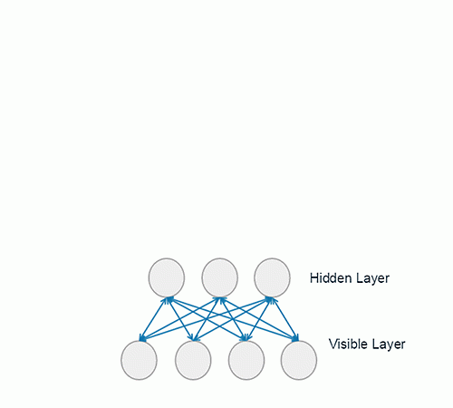
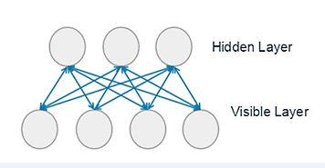
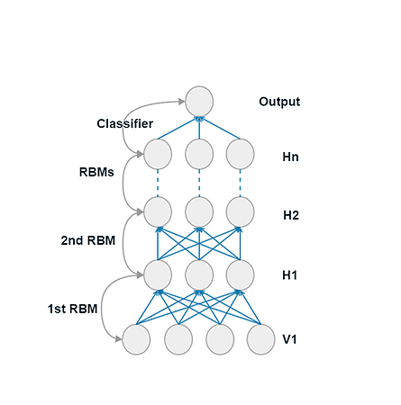
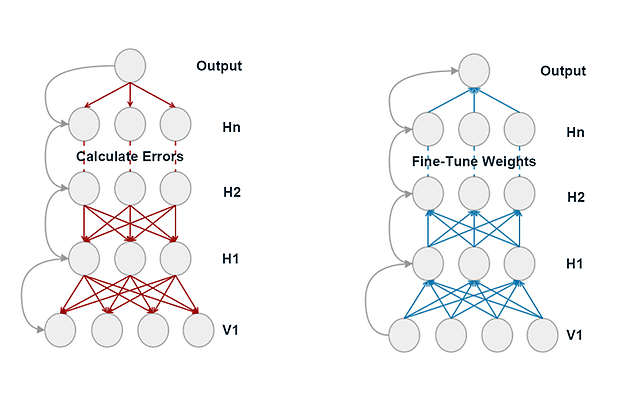

# Note: Deep Belief Network
深度置信网(Deep Belief Network)是人工神经网络的一种变种，它是一种含有随机，隐藏变量的概率生成模型。[深度置信网的逐层快速训练(A fast learning algorithm for deep belief nets)](https://www.cs.toronto.edu/~hinton/absps/fastnc.pdf)由*G.Hinton*在2006年提出。在人工神经网络的架构上加上多个限制玻尔兹曼机的预训练就是一个深度置信网。对人工神经网络不熟悉的可以参考[这里](ann.md)。
<br>
<br>
###### 为了更好地浏Mathjax公式, 推荐在Chome下安[Github with Mathjax](https://chrome.google.com/webstore/detail/github-with-mathjax/ioemnmodlmafdkllaclgeombjnmnbima). 

<br>
## 概要
* [结构](#结构)
* [限制玻尔兹曼机](#限制玻尔兹曼机)
* [预训练](#预训练)
* [反向传播](#反向传播)
* [深度置信网在生物信息学中的应用](#深度置信网在生物信息学中的应用)

<br>
## 结构
和人工神经网络相同，深度置信网由底部可见层，多个隐藏层和一个顶层分类器组成。可见层观察到的是输入特征，隐藏层负责解析隐藏特征，顶层分类器进行分类。除了可见层，其他神经元都是随机二元的来增加神经网络的稀疏性。在这个模型中我们不难看出，除了顶部的分类器，深度置信网的其他层其实是一个非监督学习的过程，它可以用来解析隐藏特征，聚类或者降维。



深度置信网的训练分为预训练(Pre-train)和反向传播两部分，深度神经网络的反向传播被称作优化(Fine-tune)。与人工神经网络最大的不同是，深度神经网络的预训练叠加了多个玻尔兹曼机(Restricted Boltzmann Machine)。我们都知道，对于一个神经网络而言，权重的初始值相当重要，而预训练的目的就是为整个神经网络提供一组较为优秀的初始权重。预训练完之后的反向传播同普通人工神经网络类似。

<br>
## 限制玻尔兹曼机
限制玻尔兹曼机(RBM)是一种周期性的随机神经网络，由G.Hinton和T.Sejnowski于1985年发明。RBM可以被视为是一种马尔可夫随机场(Markov Random Field)，或者被称作无向图模型(Undirected Graphical Model)。同单向无环的贝叶斯神经网相比，马尔可夫随机场表现出双向和有环。当马尔可夫随机场随机变量的组合概率深度是严格的正数时，它被称作是一个吉布斯随机场(Gibbs Random Field)。



上图是一个简单的限制玻尔兹曼机，它由一层显层，一层隐层和之间的连线组成。每一根连线的强度是由与两端神经元相关的权重决定。在这个模型中，由3个隐藏单元和四个显示单元。同一般的神经网络相同，第j个隐层是否被激活与所有显层神经元相关，反之，第i个显层神经元是否被激活与所有隐层的神经元相关。激活函数如下：
<br>
<br>
$p(v_i=1 | h) = \sigma(a_i + \Sigma_j h_j w_{ij})$  (eq.1)
$p(h_j=1 | v) = \sigma(b_j + \Sigma_i v_i w_{ij})$  (eq.2)
<br>
<br>
<br>
在这里$\sigma$一般取sigmoid函数：
<br>
<br>
$\sigma(z) = {1 \over 1 + e^{-z}}$
<br>
<br>
<br>
此时RBM的所有组合配置能量被定义为：
<br>
<br>
$E(v, h) = -\Sigma_i a_i v_i - \Sigma_j b_j h_j - \Sigma_{i, j} v_i h_j w_{ij}$
<br>
<br>
<br>
那么，每一组配置组合出现的概率就是：
<br>
<br>
$p(v, h) = { e^{-E(v, h)} \over Z }$
<br>
<br>
<br>
在这里，Z是：
<br>
<br>
$Z = \Sigma_{v, h} e^{-E(v, h)}$
<br>
<br>
<br>
至此，RBM的训练意义被定义为*调整权重以使得显层出现的概率最大化*(即通过多次来回传递后使显层更符合原数据)，那显层的概率p(v)就是：
<br>
<br>
$p(v) = {1 \over Z} \Sigma_h e^{-E(v, h)}$
<br>
<br>
<br>
最后我们得到梯度：
$\delta w_{ij} = \epsilon \<v^0_i h^0_j\> \<v^\infty_i h^\infty_j\>$
<br>
<br>
<br>
在以上等式中，我们唯一不知道的是$v^\infty$和$h^\infty$，为了得到这两个值，我们可以使用十分耗时的吉布斯抽样(Gibbs Sampling)不停重复显层和隐层的激活函数直到聚合。这里我们使用一种对比散度方法(Contrasive Divergence)。对比散度使用了一个小技巧，即把输入当作$v^0$输入，这样一般进行一次计算就能达到聚合，被称作(CD-1)。
<br>
```
CD-1 algorithm Pseudocode:
    1. Assign $v_0 = data$;
    2. Sample $h_0 \in {0, 1}$ from eq.2 with $v = v_0$;
    3. Sample $v_1 \in {0, 1}$ from eq.1 with $h = h_0$;
    4. Sample $h_1 \in {0, 1}$ from eq.2 with $v = v_1$;
    5. Update $w_{ij} = w_{ij} + \epsilon(v^0_i h^0_j - v^1_i h^1_j)$

The unsupervised CD algorithm can be used to pre-train all the RBM layers in a DBN step by step.
```

<br>
## 预训练
我们把多个限制玻尔兹曼机叠加起来就组成了深度置信网的预训练。需要注意的是，同深度玻尔兹曼机不同，深度置信网在每进行一层限制玻尔兹曼机的训练时，会把之前训练过的RBM的权重都固定住，这样在训练时限制了与之前训练过的RBM的交互，同时也简化了操作。



<br>
## 反向传播
深度置信网的反向传播与人工神经网络类似，这里就不多做介绍了，有兴趣的请戳[这里](ann.md#反向传播)。



<br>
## 深度置信网在生物信息学中的应用
我们直到，一个蛋白质序列由一组氨基酸组成。这个[课题](http://52.8.152.237/sean/wp-content/uploads/2016/05/DNpro-A-Deep-Learning-Network-Approach-to-Predicting-Protein-Stability-Changes-Induced-by-Single-Site-Mutations.pdf)研究的是当每个氨基酸发生突变时，对蛋白质整体能量的变化。
